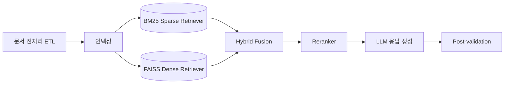

categories: [AI, RAG, NLP, Information Retrieval]  
tags: [RAG, Retriever, LLM, BM25, FAISS, Reranker, Kiwi Tokenizer, Scientific QA]

## 🧑‍🔬 Scientific Knowledge Question Answering with RAG

이번 경진대회에서는 과학 지식 질의응답 시스템을 구축하기 위해 RAG를 활용했습니다.
4200여 개의 과학 지식 문서를 색인한 후, 질문이 들어오면 과학 상식 관련 여부를 판별하고 적합한 문서를 검색·추출하여 답변을 생성합니다. 일반적인 대화라면 검색 단계를 생략하고 LLM만으로 답변을 생성합니다 .

즉, 이번 작업은 단순한 모델링 대회가 아니라 검색 엔진 최적화와 RAG 시스템 구현 자체에 집중하는 프로젝트입니다.

---

## 🔍 문제 정의
- **과학 지식(Scientific Knowledge)**은 방대하고 전문성이 강해 단순 키워드 검색으로는 적합한 정보를 찾기 어렵습니다.  
- 따라서 **검색(Retriever) + 생성(LLM)**을 결합한 **RAG 아키텍처**가 필요합니다.  

목표는 다음과 같았습니다:
1. **한국어에 최적화된 검색 성능 확보**  
2. **LLM 답변의 신뢰성 강화**  
3. **근거 기반 답변 제공으로 할루시네이션 최소화**  

---

## ⚙️ 전체 워크플로우

1. **문서 전처리 (ETL)**  
   - JSONL 문서 로드 → 청킹(Chunking) → 메타데이터 태깅  

2. **인덱싱**  
   - Sparse 검색기법: BM25  
   - Dense 검색기법: FAISS(Vector DB)  

3. **검색 단계**  
   - Hybrid 검색(Sparse + Dense 조합)  
   - 후보군 Top-K 문서 추출  

4. **생성 단계**  
   - Retriever 결과 기반 LLM 응답 생성  
   - 사후 검증(Post-validation)으로 답변과 근거 정합성 확인  

---

## 🧩 Retriever 설계: Kiwi BM25
한국어 텍스트 검색 품질 향상을 위해 **Kiwi Tokenizer**를 적용했습니다.  

- **BM25 기반 Sparse 검색**  
- **청킹 전략**  
  - RecursiveCharacterTextSplitter → Chunk 단위 검색  
  - 원문 단위 검색  

이를 통해 **한국어 문서 특성을 반영한 효율적인 검색**이 가능해졌습니다.  

---

## 📊 Reranking & LLM
Hybrid 검색 결과만으로는 여전히 **정확성(precision)**에 한계가 있습니다.  
따라서 **Cross-Encoder Reranker**를 추가하여 Query-Doc 쌍의 적합도를 재평가했습니다.  

- **1차 검색**: BM25 / FAISS Hybrid 검색  
- **2차 재정렬**: Reranker 기반 Query-Doc relevance 계산  
- **최종 LLM 응답**:
  - 근거 문서와 답변을 연결  
  - 근거 인용 강제 → **Hallucination 최소화**  

---

## ✅ 기대 효과
- **검색 성능 향상**: Sparse + Dense Hybrid + Kiwi Tokenizer  
- **정확도 개선**: Cross-Encoder Reranker 도입  
- **투명성 강화**: Post-validation으로 근거 문서와 답변 동시 제공  

---

## 🚀 결론 및 향후 방향
이번 프로젝트는 **한국어 과학 지식 QA 시스템**을 위한 **RAG 파이프라인 최적화 사례**입니다.  

핵심 요소:
- Hybrid Retrieval (Sparse + Dense)  
- 한국어 최적화 Kiwi BM25  
- Reranker 기반 최종 재정렬  

앞으로는 다음과 같은 방향으로 확장할 수 있습니다:
- **다국어 지원**  
- **대규모 과학 문헌 확장**  
- **전문 도메인별 튜닝**  

> RAG는 단순한 검색·생성을 넘어, **정확하고 신뢰할 수 있는 과학 지식 질의응답**의 핵심 기술로 자리 잡고 있습니다.  
